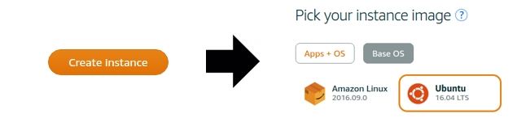
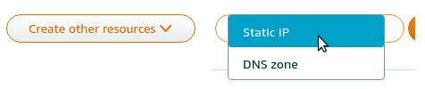
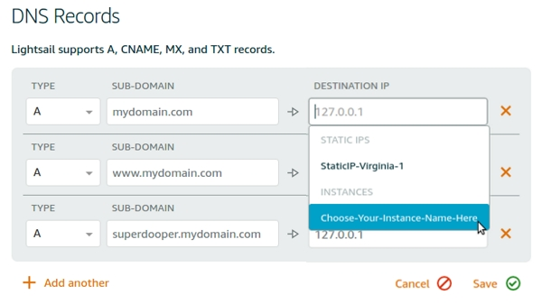

A STEP-BY-STEP TUTORIAL:
<h1>INSTALL DOKKU ON AMAZON AWS LIGHTSAIL</h1>

 

TODOS:  This article is still a work-in-progress...
- add Let's Encrypt using dokku-letsencrypt HTTPS
- add SWAP file on server with less than 1GIG RAM
- add domains to Dokku manually

 
##TABLE OF CONTENTS:
  * [**PREREQUISITES:** What you need before you start](#prerequisites)
  * [**STEP #1:** Create a new AWS Ubuntu server instance](#step-1)
  * [**STEP #2:** Connect to your new server and apply updates](#step-2)
  * [**STEP #3:** Create and assign a new static IP address](#step-3)
  * [**STEP #4:** Add a new DNS Zone](#step-4)
  * [**STEP #5:** Configure the DNS Zone](#step-5)
  * [**STEP #6:** Open the HTTPS port in the AWS Firewall](#step-6)
  * [**STEP #7:** Point your domain name to AWS](#step-7)
  * [**STEP #8:** Install Dokku](#step-8)
  * [**STEP #9:** Create your RSA private/public key pair](#step-9)
  * [**STEP #10:** Add your public key to Dokku](#step-10)
  * [**STEP #11:** xxxxxxxxxxxxxxxxxx](#step-11)
  * [**STEP #12:** xxxxxxxxxxxxxxxxxx](#step-12)
  * [**STEP #13:** xxxxxxxxxxxxxxxxxx](#step-13)
  * [**STEP #14:** xxxxxxxxxxxxxxxxxx](#step-14)
  * [**STEP #15:** xxxxxxxxxxxxxxxxxx](#step-15)
  * [**STEP #16:** xxxxxxxxxxxxxxxxxx](#step-16)

 
 
##PREREQUISITES:
1. You will need your own registered domain name (i.e. mydomain.com) and will need administrative access to modify the DNS settings for it on your registrar's website.

2. You will need to sign-up for an AWS account and be able to  login to LightSail (www.amazonlightsail.com).

 
 
##STEP #1
<h3>CREATE A NEW AWS UBUNTU SERVER INSTANCE</h3>

- Login to your LightSail account. Click the **CREATE INSTANCE** button. Under 'Pick your instance image', click the **BASE OS** button. Then, choose **UBUNTU**.

 

- Scroll down and you will see: "You are using the default SSH key pair for connecting to your instance." If you wish, you can create a new SSH key here, but it is not necessary. We will use the DEFAULT SSH KEY. 

- Scroll down and CHOOSE YOUR INSTANCE PLAN. Click on the **$5/month** instance plan to begin with. We can always up-size to a larger instance later as needed. 

- Scroll down and NAME YOUR INSTANCE. You can keep the default name, or give it any name you wish. I will name mine: **Dokku1**.

- Finally, hit the **CREATE** button.

In a few minutes, your new server instance will be ready.

 
 
##STEP #2
<h3>Connect to your new server and apply updates</h3>

Use the browser-based terminal window to connect to your server instance and update it.

- Find your new server instance. You will see three vertical dots. Click them and select **CONNECT** from the list. A terminal emulator window should pop-up with a command prompt.

- In the command prompt, type: 

~~~
sudo apt update
~~~

Then:

~~~
sudo apt upgrade
~~~

You will be asked: ** Do you want to continue? [Y/n] **. Type:
~~~
yes
~~~

This will install a bunch of updates for your Ubuntu Linux server. This could take about 5 minutes or so. Be patient.

- Finally, type: 

~~~
sudo reboot
~~~

This will reboot the server and disconnect you from the terminal window. You can now close the terminal window. 

Your Ubuntu Linux server is now updated with the latest OS updates.

 
 
##STEP #3
<h3>CREATE AND ASSIGN A STATIC IP </h3>
First, setup a static IP address for your new server. By default, your new server instance will get a new IP address everytime it restarts. We don't want this. We want our IP address to stay the same forever.

- Click the CREATE OTHER RESOURCES button/menu and choose STATIC IP.

 

- Go to ATTACH TO AN INSTANCE. Select the instance you just created from the SELECT AN INSTANCE menu. Mine is: Dokku1. Yours will be whatever you named your instance. 

- (optional) Under NAME YOUR STATIC IP, you can enter in a custom name. I used the default name.

- Click the CREATE button.

 
 
##STEP #4
<h3>ADD A NEW DNS ZONE</h3>
Next, we want to create a new DNS ZONE for our domain name.

- Click the CREATE OTHER RESOURCES button/menu again, choose DNS ZONE.

 

- Create DNS Zone. Enter your domain name in the box under ENTER THE DOMAIN NAME YOU HAVE REGISTERED. You do not need the "WWW." before your domain name. For example: mydomainname.com.

- Scroll down and click the CREATE DNS ZONE button.

 
 
##STEP #5
<h3>CONFIGURE THE DNS ZONE</h3>
You should now be on the DETAILS page of your new DNS ZONE. Let's add some DNS Records to our new DNS ZONE.

 

 
**First DNS Entry:**

- Click on the link-button:  **+ ADD ANOTHER**

~~~
TYPE: A
SUB-DOMAIN: MYDOMAIN.COM (NO WWW. OR DOT BEFORE NAME)
DESTINATION IP: (CHOOSE YOUR SERVER INSTANCE FROM THE MENU)
~~~
    
- Click **SAVE**.

 
**Second DNS Entry:**

- Click on the link-button:  **+ ADD ANOTHER**

~~~
TYPE: A
SUB-DOMAIN: WWW.MYDOMAIN.COM (NO WWW OR DOT BEFORE NAME)
DESTINATION IP: (CHOOSE YOUR SERVER INSTANCE FROM THE MENU)
~~~
    
- Click **SAVE**.

 
**Third DNS Entry: Adding additional DNS entries for each new Dokku app:**

For each additional Dokku app that you add to your server, you will want to create a new A-RECORD for each new sub-domain.

For example, if you create a new Dokku app called: **'SUPERDOOPER'**, you will need to create the following DNS entry:

    TYPE: A
    SUB-DOMAIN: SUPERDOOPER.MYDOMAIN.COM
    DESTINATION IP: (CHOOSE YOUR SERVER INSTANCE FROM THE MENU)

- Click **SAVE**.

 
 
##STEP #6
<h3>OPEN HTTPS PORT IN THE AWS FIREWALL</h3>

In order for web visitors to be able to visit your sites over HTTPS,
we need to open a port in the AWS firewall.

- Click on the AMAZON LIGHTSAIL logo in the upper-right-hand corner. This will take you back to the main screen.

- Find your new server instance. You will see three vertical dots. Click them and select **MANAGE** from the list.

- Click the **NETWORKING** link. Scroll down to the FIREWALL settings. You should see the following settings:

~~~
	APPLICATION			PROTOCOL		PORT RANGE

	SSH					TCP				22
	HTTP				TCP				80
~~~

- Click the button/link: **+ ADD ANOTHER**

- Under APPLICATION, select **HTTPS** from the menu. The PROTOCOL and PORT RANGE fields are set for you automatically.

- Click **SAVE** to lock in the new settings.

 
 
##STEP #7
<h3>POINT YOUR DOMAIN NAME TO AWS</h3>

Now that we have created a static IP address and a DNS ZONE, we can configure the domain on your registrar's website to point to AWS.

- In a new brower window, you will need to login to your registrar's website. The registrar is the company that you used when you registered the domain name. My domain name was registered on GoDaddy.com, but your registrar should have similar settings.

- Once logged in, you will want to find the domain name that you want to point to AWS. Select it and look for settings similar to: MANAGE or MANAGE DNS SETTTINGS.

- Look for NAMESERVERS or USE CUSTOM NAMESERVERS. We need to enter in some addresses that will point this domain's DNS to AWS. We will get theses addresses from the AWS/LightSail website.

- Go back to the AWS/LightSail website. Click on the logo in the upper-right-hand corner so that you are on the main page. Sroll down to the DNS ZONE you created with your domain name. Click on the three vertical dots and choose MANAGE.

- Scroll down to the bottom of the page until you see NAMESERVERS. These are the namesevers that you will need to enter into your registrar's CUSTOM NAMESERVERS entry box. Enter all four of them. Be sure to hit SAVE.

Now, your domain name is pointed to AWS.

 
 
##STEP #8
<h3>INSTALL DOKKU</h3>

- Click on the AMAZON LIGHTSAIL logo in the upper-right-hand corner. This will take you back to the main screen.

- Use default SSH key. Download key to your local machine and store it in: ~/.ssh/

- On LightSail, click on your new instance name. This will take you to MANAGE settings. 

- Assign the new instance a Static IP.

- Go to MANAGE

- Connect to new instance using SSH. ($ ssh -i ~/.ssh/AWS/LightsailDefaultPrivateKey.pem ubuntu@emveeoh.com).

- Run UPDATE and UPGRADE on Ubuntu to make the installation current. ($ sudo apt update && sudo apt upgrade).

- Install DOKKU with curl script found at: http://dokku.viewdocs.io/dokku

 
 
##STEP #9
<h3>CREATE YOUR RSA PRIVATE/PUBLIC KEY PAIR FOR SSH CONNECTION TO DOKKU</h3>

These step-by-step directions were sourced from a Digital Ocean tutorial:
[Digital Ocean - RSA private/public key creation](https://www.digitalocean.com/community/tutorials/how-to-set-up-ssh-keys--2) 

- On your local machine, run this terminal command: $ ssh-keygen -t rsa

- Enter file in which to save the key (/home/mvo/.ssh/id_rsa). Give it a name. Example: dokku1-key

- Pass phrase is optional. You will have to type this each time you connect. Leave it blank if you want faster login.

- Two files were created for you. Both have the same name, but one will have the extension .pub. Grab these files and put them in: ~/.ssh/

You now have the public/private key you need to SSH into your Dokku server.

 
 
##STEP #10
<h3>ADD THE PUBLIC KEY TO DOKKU</h3>

- Get IP Address for new LightSail instance. Open this URL in browser. Should be a static IP.

- You should see: Dokku Setup and it should already have the PUBLIC KEY text pasted into the Public Key box. Erase any text that might appear before the text "ssh-rsa". This is not part of the key. 

- In the HOSTNAME box, enter in a domain name that you have registered.

- Check the box "Use virtualhost naming for apps".

- Click "Finish Setup". 

Your Dokku instance is now ready to receive site/app uploads.

 
 
##STEP #11
<h3>xxxxxxxxxxxxxxxxxxxxxxx</h3>

 
 
##STEP #12
<h3>xxxxxxxxxxxxxxxxxxxxxxx</h3>

 
 
##STEP #13
<h3>xxxxxxxxxxxxxxxxxxxxxxx</h3>

 
 
##STEP #14
<h3>xxxxxxxxxxxxxxxxxxxxxxx</h3>

 
 
##STEP #15
<h3>xxxxxxxxxxxxxxxxxxxxxxx</h3>

 
 
##STEP #16
<h3>xxxxxxxxxxxxxxxxxxxxxxx</h3>

